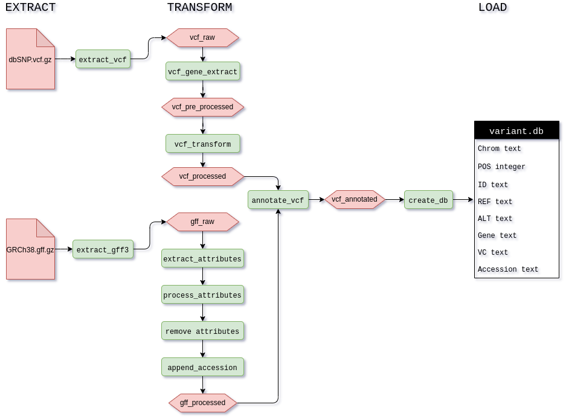

# vcf-pipeline
#### An ETL pipeline that ingests VCF and GFF3 files to produce an SQL Database of annotated variants.

## Data:
Variant and Gene annotation data was obtained from NCBI’s Human Genome Resources

## Tools used:
I decided to use Streamlit to build a web app for this pipeline so that it can be shared and modifed to print logs, stream data from AWS S3, or build it out into a multipage app.

The core functionality comes from Pandas, while also using Pysam and SQLite3

Code refactoring was done using Sourcery and Autopep8 was used to ensure PEP8 formatting
## Project structure:

## ETL Pipeline:

### Extract:
The pipeline is built using three modules that are aptly named: extract, transform, load

The extraction phase calls to main functions to parse the data and to create pandas dataframes for both files

### Transform:
The transformation phase formats the VCF first and then goes on create pandas dataframes for both files. The next part of the pipeline takes the gff dataframe as input into the pandas pipe, which is a group of functions that take the output of the preceeding function as their input.
### Load:

## Reproducing the project:
